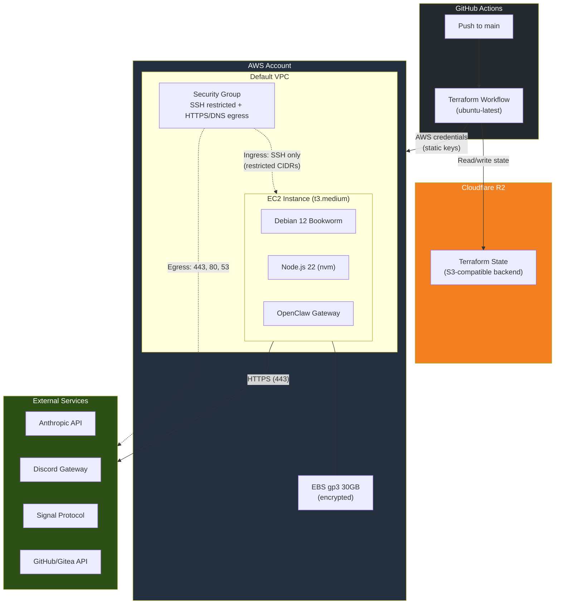
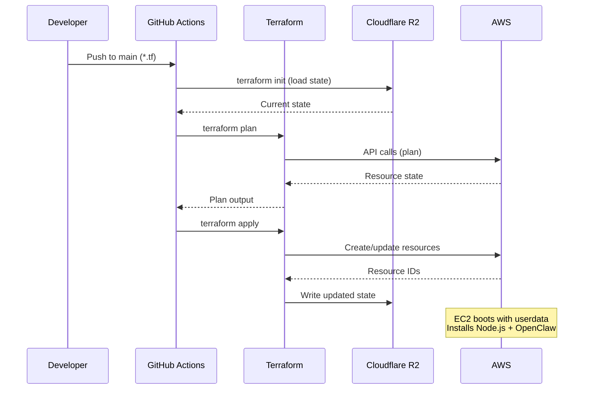

# Clawdbot AWS — EC2 Deployment

Deploy [OpenClaw](https://github.com/openclaw/openclaw) (AI assistant) on a `t3.medium` EC2 instance with automated provisioning via Terraform and GitHub Actions.

## Architecture



## Deployment Flow



## What's Deployed

| Resource | Details |
|----------|---------|
| **EC2 Instance** | t3.medium (2 vCPU, 4 GB RAM) — Debian 12 |
| **EBS Volume** | 30 GB gp3, encrypted, delete-on-termination |
| **Security Group** | SSH ingress (restricted CIDRs), HTTPS/HTTP/DNS egress |
| **Key Pair** | SSH public key for instance access |
| **User Data** | Automated bootstrap: Node.js, OpenClaw, systemd service |

### Security Highlights
- **IMDSv2 enforced** (no v1 token requests)
- **SSH restricted** to explicitly allowed CIDRs (default: none)
- **Egress limited** to HTTPS (443), HTTP (80), and DNS (53)
- **EBS encrypted** at rest

## Prerequisites

- AWS account with default VPC
- IAM user with API keys (see [IAM Setup](#iam-setup) below)
- [Cloudflare R2 bucket](https://developers.cloudflare.com/r2/) for Terraform state backend
- GitHub repository with Actions enabled

### Cloudflare R2 Setup (State Backend)

1. Go to **Cloudflare Dashboard → Storage & Databases → R2 → Create Bucket**
2. Choose **wnam** location, **Standard** storage class
3. Create an **R2 API Token** with **Object Read & Write** permissions
4. Note the **bucket name**, **endpoint URL**, **access key**, and **secret key**

> R2 free tier covers this easily — tfstate files are tiny.

### IAM Setup

This repo does **not** create IAM resources — users, roles, policies, and keys are managed outside of Terraform for now. You need an IAM user with API keys that have the minimum permissions to build what's in this repo.

<details>
<summary>Minimum IAM Policy (scoped to this repo's resources)</summary>

```json
{
  "Version": "2012-10-17",
  "Statement": [
    {
      "Sid": "EC2Management",
      "Effect": "Allow",
      "Action": [
        "ec2:RunInstances",
        "ec2:TerminateInstances",
        "ec2:StartInstances",
        "ec2:StopInstances",
        "ec2:DescribeInstances",
        "ec2:DescribeInstanceStatus",
        "ec2:DescribeImages",
        "ec2:DescribeVolumes",
        "ec2:DescribeVpcs",
        "ec2:DescribeSubnets",
        "ec2:DescribeSecurityGroups",
        "ec2:DescribeKeyPairs",
        "ec2:DescribeNetworkInterfaces",
        "ec2:DescribeInstanceAttribute",
        "ec2:ModifyInstanceAttribute",
        "ec2:DescribeInstanceTypes",
        "ec2:DescribeTags",
        "ec2:DescribeAvailabilityZones",
        "ec2:DescribeAccountAttributes",
        "ec2:CreateTags",
        "ec2:DeleteTags"
      ],
      "Resource": "*"
    },
    {
      "Sid": "SecurityGroupManagement",
      "Effect": "Allow",
      "Action": [
        "ec2:CreateSecurityGroup",
        "ec2:DeleteSecurityGroup",
        "ec2:AuthorizeSecurityGroupIngress",
        "ec2:AuthorizeSecurityGroupEgress",
        "ec2:RevokeSecurityGroupIngress",
        "ec2:RevokeSecurityGroupEgress",
        "ec2:DescribeSecurityGroupRules"
      ],
      "Resource": "*"
    },
    {
      "Sid": "KeyPairManagement",
      "Effect": "Allow",
      "Action": [
        "ec2:CreateKeyPair",
        "ec2:DeleteKeyPair",
        "ec2:ImportKeyPair"
      ],
      "Resource": "*"
    },
    {
      "Sid": "EBSManagement",
      "Effect": "Allow",
      "Action": [
        "ec2:CreateVolume",
        "ec2:DeleteVolume",
        "ec2:AttachVolume",
        "ec2:DetachVolume",
        "ec2:ModifyVolume"
      ],
      "Resource": "*"
    }
  ]
}
```

> **Tip:** Add `"Condition": {"StringEquals": {"aws:RequestedRegion": "us-west-2"}}` to restrict operations to your deployment region.

</details>

**Future improvement:** Replace static keys with [GitHub Actions OIDC federation](https://docs.github.com/en/actions/security-for-github-actions/security-hardening-your-deployments/configuring-openid-connect-in-amazon-web-services) for keyless authentication.

## GitHub Actions Setup

### Repository Secrets

Go to **Settings → Secrets and variables → Actions** and add:

| Secret | Description |
|--------|-------------|
| `AWS_ACCESS_KEY_ID` | IAM user access key |
| `AWS_SECRET_ACCESS_KEY` | IAM user secret key |
| `BUCKET_NAME` | R2 bucket name |
| `BUCKET_KEY` | State file path (e.g. `clawdbot-aws/terraform.tfstate`) |
| `BUCKET_ENDPOINT` | `https://<account-id>.r2.cloudflarestorage.com` |
| `BUCKET_ACCESS_KEY_ID` | R2 API access key |
| `BUCKET_SECRET_ACCESS_KEY` | R2 API secret key |
| `SSH_PUBLIC_KEY` | Your SSH public key (full key string) |
| `ALLOWED_SSH_CIDRS` | JSON array of CIDRs, e.g. `["1.2.3.4/32"]` |

### Workflows

| Workflow | Trigger | What it does |
|----------|---------|-------------|
| **terraform-build** | Push to `main` (*.tf, userdata.sh) | Plan + Apply |
| **terraform-destroy** | Manual dispatch | Destroy all resources |

> **Note:** Enable **Read and write permissions** under Settings → Actions → General → Workflow permissions.

## Post-Deploy Setup

After the instance is running:

```bash
# SSH in (Debian default user is 'admin')
ssh -i ~/.ssh/your-key admin@<public-ip>

# Switch to clawdbot user
sudo su - clawdbot

# Configure OpenClaw
openclaw init

# Start the service
sudo systemctl start openclaw
```

The bootstrap script (userdata.sh) automatically installs Node.js, OpenClaw, and creates a systemd service.

## Customization

| Variable | Default | Description |
|----------|---------|-------------|
| `aws_region` | `us-west-2` | AWS region |
| `instance_type` | `t3.medium` | EC2 instance type |
| `root_volume_size` | `30` | EBS volume size (GB) |
| `node_version` | `22` | Node.js major version |
| `subnet_id` | `""` | Subnet (empty = default VPC) |
| `allowed_ssh_cidrs` | `[]` | SSH access CIDRs |
| `ami_owner` | `136693071363` | AMI owner (Debian official) |

## Optional: Cloudflare DNS

The `dns.tf` file contains commented-out examples for CNAME records via Cloudflare. Uncomment and configure if you want DNS pointing to your instance.

Requires additional secrets: `CLOUDFLARE_API_TOKEN`, `CLOUDFLARE_ZONE_ID`.

## Costs

**7-day test: ~$8.40** | **Monthly: ~$36/mo** (AWS infra only, excludes Anthropic API plan)

See [COSTS.md](COSTS.md) for full breakdown with optimization options.

## References

- [OpenClaw Documentation](https://docs.openclaw.ai)
- [Terraform AWS Provider](https://registry.terraform.io/providers/hashicorp/aws/latest/docs)
- [GitHub Actions OIDC with AWS](https://docs.github.com/en/actions/security-for-github-actions/security-hardening-your-deployments/configuring-openid-connect-in-amazon-web-services)
- [Cloudflare R2 Remote Backend](https://developers.cloudflare.com/terraform/advanced-topics/remote-backend/)
- [AWS EC2 Pricing](https://aws.amazon.com/ec2/pricing/on-demand/)
