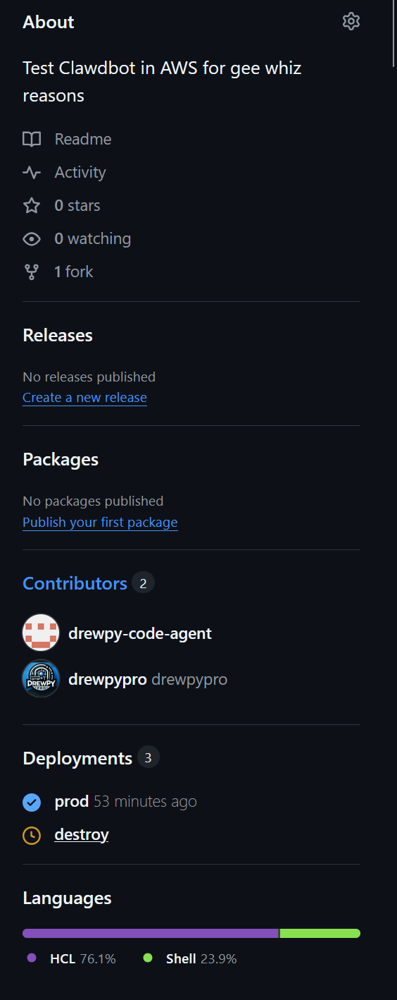
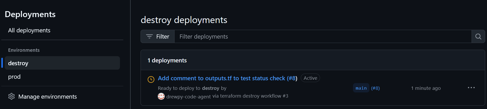
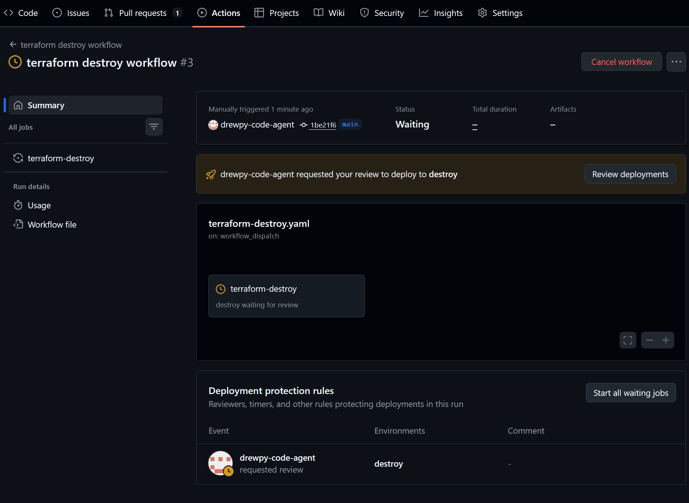
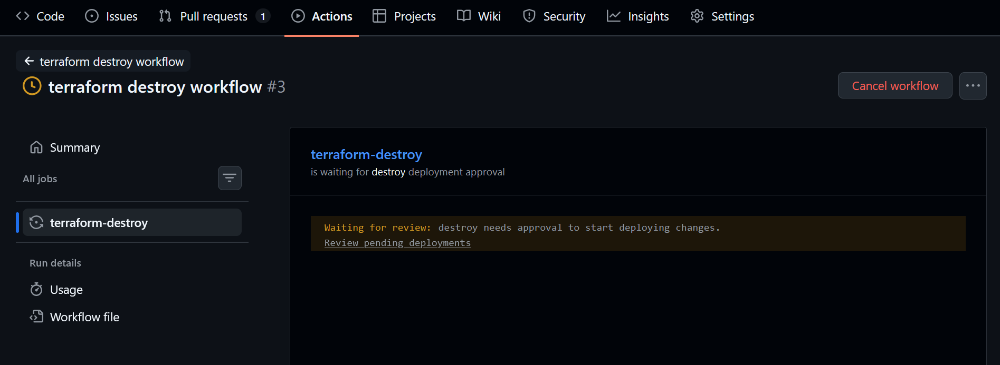
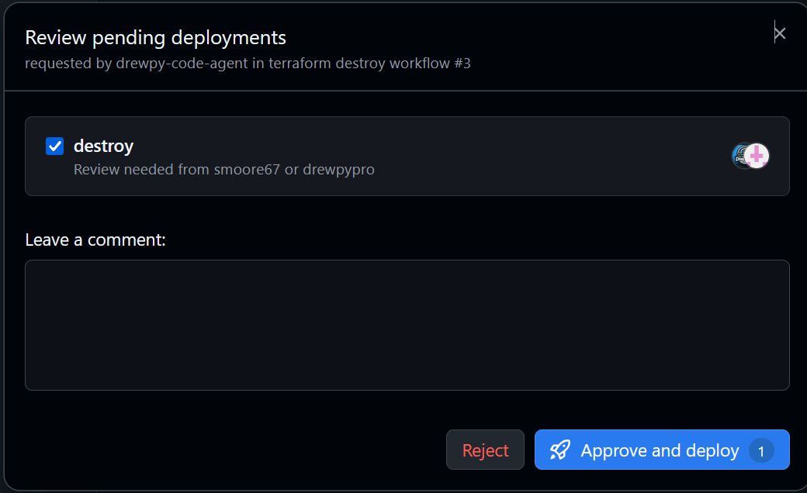

# Branch Protection & Rulesets Guide

*Last updated: 2026-02-19 · Tested with GitHub Free plan, OpenClaw 2026.2.15*

> **⚠️ Disclaimer:** This document was collaboratively created by a human ([drewpypro](https://github.com/drewpypro)) and an AI bot ([drewpy-code-agent](https://github.com/drewpy-code-agent)) running [OpenClaw](https://github.com/openclaw/openclaw). While we've tested these configurations hands-on, **take everything with a grain of salt**. Further testing is needed and additional learning opportunities remain. Always validate against [official GitHub documentation](https://docs.github.com/en/repositories/configuring-branches-and-merges-in-your-repository/managing-rulesets/about-rulesets) before applying to production repositories.
>
> **⚠️ Caution — Financial & Liability Risk:** This repo deploys infrastructure to AWS using Terraform. Running AI-managed infrastructure automation carries **real financial risk** (unexpected resources, forgotten teardowns, runaway costs) and **personal liability**. We don't recommend replicating this setup without thorough understanding of both the AI tooling and AWS billing implications. This is a learning exercise, not a production blueprint.
>
> **📝 Note on screenshots:** All screenshots in this document were taken by the human collaborator, pasted into Discord in order (without filenames), and the AI bot analyzed each image using vision capabilities to automatically name, sort, and place them in the appropriate documentation sections.

This document covers the GitHub branch protection ruleset configuration for `drewpypro/clawdbot-aws`, including what each setting does, why we chose our configuration, and lessons learned during setup.

---

## Table of Contents

- [Overview](#overview)
- [Ruleset Configuration](#ruleset-configuration)
  - [Bypass List](#bypass-list)
  - [Target Branches](#target-branches)
  - [Branch Rules](#branch-rules)
- [Required Status Checks](#required-status-checks)
- [Pull Request Requirements](#pull-request-requirements)
- [Environment Protection (Deployment Gates)](#environment-protection-deployment-gates)
- [Lessons Learned](#lessons-learned)

---

## Overview

We use GitHub **repository rulesets** (the newer replacement for legacy branch protection rules) to protect the `main` branch. Rulesets provide more granular control and can target multiple branches with a single configuration.

Our ruleset is named **`main`** and is set to **Active** enforcement.


---

## Ruleset Configuration

### Bypass List

| Actor | Type | Permission |
|-------|------|------------|
| Repository admin | Role | Always allow |

**What it means:** Only repository admins can bypass the ruleset rules. This is important to understand — **bypass means exempt from ALL rules**, not just specific ones. A bypass actor can force push, merge without approvals, skip status checks, etc.

**Why this matters for bots:** We intentionally do NOT add the bot account (`drewpy-code-agent`) to the bypass list. If the bot were a bypass actor, it could merge PRs without any human approval, defeating the purpose of branch protection. Instead, the bot operates as a regular collaborator — it can create PRs and merge them via API, but only after all required checks and approvals are satisfied.

### Target Branches

The ruleset targets the **Default** branch (`main`). All rules apply only to pushes and merges into `main`.

### Branch Rules

| Rule | Enabled | Description |
|------|---------|-------------|
| **Restrict creations** | ✅ | Only bypass actors can create refs matching the target. Prevents accidental creation of branches that match protected patterns. |
| **Restrict updates** | ❌ | If enabled, only bypass actors can push commits that target `main` — including merging pull requests. We initially enabled this but discovered it blocked the bot (`drewpy-code-agent`) from merging approved PRs via the API, since the bot is not a bypass actor. Disabling this is safe because "Require a pull request before merging" already prevents direct pushes to `main`, and code owner approval ensures human review. The combination of PR requirements + code owner review provides the access control without needing restrict updates. |
| **Restrict deletions** | ✅ | Prevents anyone (except bypass actors) from deleting the `main` branch. |
| **Require linear history** | ❌ | Would prevent merge commits. We allow all merge methods (merge, squash, rebase) so this stays off. |
| **Require signed commits** | ✅ | All commits pushed to `main` must have verified GPG signatures. This ensures commit authenticity and prevents impersonation. |
| **Block force pushes** | ✅ | Prevents force pushes to `main`. History rewriting on the default branch is never acceptable. Force pushes on feature branches are fine. |

---

## Pull Request Requirements

All changes to `main` must go through a pull request. Direct pushes are blocked.


| Setting | Value | Description |
|---------|-------|-------------|
| **Required approvals** | 1 | At least one approving review is needed before merge. |
| **Dismiss stale approvals** | ❌ | New commits don't automatically dismiss existing approvals. Consider enabling this for stricter workflows. |
| **Require Code Owner review** | ✅ | Files with designated code owners in `CODEOWNERS` require approval from those owners. |
| **Require approval of most recent push** | ❌ | The person who pushed can also be an approver. For small teams this is practical. |
| **Require conversation resolution** | ❌ | PR comments don't need to be resolved before merge. |
| **Allowed merge methods** | Merge, Squash, Rebase | All three methods are allowed. Squash is commonly used for cleaner history. |

### CODEOWNERS

The `CODEOWNERS` file (in the repo root) defines who must approve changes to specific files:

```
# Example CODEOWNERS
* @drewpypro @smoore67
```

**Important:** The usernames in CODEOWNERS must match actual GitHub usernames exactly. We learned this the hard way when `smoore5288` needed to be corrected to `smoore67`.

---

## Required Status Checks

Status checks ensure that automated tests pass before a PR can be merged.


| Setting | Value | Description |
|---------|-------|-------------|
| **Required check** | `terraform-plan` | The GitHub Actions workflow job that must pass. |
| **Require up-to-date branches** | ❌ | PRs don't need to be rebased on latest `main` before merging. Enable for stricter workflows. |
| **Skip checks on creation** | ❌ | Status checks are required even on newly created branches. |

### How Status Check Names Work

This is a common source of confusion. The required status check name must match the **job name** in your GitHub Actions workflow, not the workflow name or file name.

```yaml
# .github/workflows/terraform-plan.yaml
name: terraform-plan          # ← workflow name
on:
  pull_request:
    paths: ['*.tf', 'userdata.sh']

jobs:
  terraform-plan:              # ← THIS is the status check name
    runs-on: ubuntu-latest
    ...
```

The required check is `terraform-plan` (the job key). GitHub reports status checks by job name.

### Path-Filtered Workflows (Solved)

Initially, our `terraform-plan` workflow only triggered on changes to `*.tf` and `userdata.sh` files. This caused a problem: PRs that only changed non-TF files (docs, workflows, CODEOWNERS) would never trigger the required status check, leaving the PR stuck forever.

**Our solution:** We removed the path filter from the workflow trigger and added runtime detection instead. The workflow now runs on **all PRs** and the `terraform-plan` **job always executes and reports a status** — satisfying the required check. However, the individual *steps* within the job (terraform init, validate, plan) are conditionally skipped when no Terraform files have changed. This is **not** bypassing branch protection — the required check still runs and passes; it just doesn't do unnecessary work on docs-only PRs.

See the [Conditional Status Checks](#conditional-status-checks-path-filtered-workaround) section below for implementation details.

---

## Environment Protection (Deployment Gates)

Beyond branch protection, we use **GitHub Environments** to gate destructive operations like `terraform destroy`.

### How It Works

1. The destroy workflow references an environment:
   ```yaml
   jobs:
     terraform-destroy:
       environment: destroy    # ← requires environment approval
       runs-on: ubuntu-latest
   ```

2. The `destroy` environment is configured with **required reviewers** — specific GitHub users who must manually approve the deployment before it runs.

3. When the workflow is triggered, it pauses at the environment gate and waits for approval in the GitHub Actions UI.

### Visual Walkthrough

**Repository overview** — The deployments section shows active environments and their status. Here you can see `prod` (deployed) and `destroy` (pending):



**Deployment gate** — When a destroy workflow runs, it shows as "Ready to deploy" and waits for approval:



**Workflow waiting for approval** — The Actions summary shows the job is paused, waiting for a reviewer to approve the deployment:



**Job-level view** — The individual job shows the "Waiting for review" status with a link to review pending deployments:



**Review dialog** — Reviewers see this modal where they can approve or reject the deployment. Only designated reviewers (configured in the environment settings) can approve:



### Why This Matters

- **Prevents accidental destruction:** Even if someone (or a bot) triggers the destroy workflow, it won't execute until a human approves it.
- **Audit trail:** GitHub logs who approved each deployment and when.
- **Separation of concerns:** Branch protection controls what gets merged; environment protection controls what gets deployed/destroyed.

---

## Bot Account Security

When using a bot/service account for CI/CD automation, follow these security practices:

### Dedicated Account
Create a dedicated GitHub account for the bot (e.g., `drewpy-code-agent`) rather than using a personal account's token. This provides:
- **Auditability** — bot actions are clearly attributable in commit/PR history
- **Least privilege** — the bot account only has access to repos it needs
- **Revocability** — you can disable the bot without affecting personal access

### Personal Access Token (PAT) Scoping

| Token Type | Scope | Risk |
|-----------|-------|------|
| **Fine-grained PAT** (recommended) | Scoped to specific repos | Lowest risk — can only access named repositories |
| **Classic PAT** with `repo` scope | All repos the account can access | ⚠️ Can read/write ANY repo the account has access to, including public repos |

**⚠️ Critical warning about classic PATs:** A classic `repo`-scoped token grants read access to all public repositories and write access to any repo where the bot is a collaborator. If the bot accepts a repository invitation (something you should **never** allow), an attacker could:
1. Invite the bot to a malicious repository
2. Coax the bot into pushing commits containing sensitive data (secrets, tokens, source code)
3. Create data exfiltration paths through git push

**Mitigations:**
- Use **fine-grained PATs** scoped to only the repos the bot needs ([docs](https://docs.github.com/en/authentication/keeping-your-account-and-data-secure/managing-your-personal-access-tokens#fine-grained-personal-access-tokens))
- Never allow the bot to accept repository invitations automatically
- Set token expiration dates and rotate regularly
- Monitor the bot account's [security log](https://docs.github.com/en/authentication/keeping-your-account-and-data-secure/reviewing-your-security-log) for unexpected activity
- Consider using a [GitHub App](https://docs.github.com/en/apps/creating-github-apps/about-creating-github-apps/about-creating-github-apps) instead of a PAT for even tighter scoping (per-repo installation, no implicit public repo access)

### Self-Approval Limitation

GitHub prevents any user (including bots) from approving their own pull requests. This means:
- A bot that creates a PR **cannot** also approve it
- At least one *different* collaborator must approve before merge
- This is a security feature, not a bug — it enforces separation of duties

---

## Conditional Status Checks (Path-Filtered Workaround)

GitHub's required status checks don't natively support conditional requirements based on file paths. If a required check's workflow only triggers on `*.tf` files, docs-only PRs will be stuck forever waiting.

### Solutions

**1. Path-based pass-through job (recommended)**

Add a lightweight job to your workflow that always runs, regardless of paths changed. Use the same job name as the required check:

```yaml
on:
  pull_request:
    # No path filter — runs on ALL PRs

jobs:
  terraform-plan:
    runs-on: ubuntu-latest
    steps:
      - uses: actions/checkout@v4

      - name: Check for TF changes
        id: changes
        run: |
          TF_CHANGES=$(git diff --name-only origin/main...HEAD | grep -cE '\.(tf|sh)$' || true)
          echo "has_tf=$([[ $TF_CHANGES -gt 0 ]] && echo true || echo false)" >> "$GITHUB_OUTPUT"

      - name: Terraform Init
        if: steps.changes.outputs.has_tf == 'true'
        run: terraform init

      - name: Terraform Plan
        if: steps.changes.outputs.has_tf == 'true'
        run: terraform plan
```

This way the `terraform-plan` check always reports a status (satisfying the requirement), but only actually runs terraform when relevant files changed.

**2. Third-party path filter actions**

Alternative approaches exist, such as [dorny/paths-filter](https://github.com/dorny/paths-filter), which provides a reusable action for detecting changed files. This can simplify workflow logic compared to hand-rolling `git diff` commands. As with any third-party GitHub Action, pin to a specific commit SHA and review the source — see [Lesson #6](#6-supply-chain-risks).

**3. Admin bypass** — Repo admins can merge regardless of status check requirements. Quick but doesn't scale.

---

## Lessons Learned

### 1. Bypass = Exempt from EVERYTHING
Adding an actor to the bypass list exempts them from **all** rules in the ruleset — not just the merge gate. Don't add bot accounts to bypass unless you want them to have unrestricted access.

### 2. Bot Merge Flow
A bot (like `drewpy-code-agent`) with push/write access CAN merge PRs via the GitHub API — but only after all required checks and approvals are satisfied. The flow:
1. Bot creates a branch and PR
2. CI runs status checks (e.g., `terraform-plan`)
3. Code owner(s) approve the PR
4. Bot calls `PUT /repos/{owner}/{repo}/pulls/{pull_number}/merge`
5. GitHub validates all rules are met, then merges

### 3. GPG Signing for Bots
When "Require signed commits" is enabled, bot commits must also be GPG-signed. Generate a GPG key for the bot account, upload the public key to GitHub, and configure git:
```bash
git config --global user.signingkey <KEY_ID>
git config --global commit.gpgsign true
```

### 4. Status Check Names ≠ Workflow Names
The required status check must match the **job name** in your workflow YAML, not the workflow `name:` field or the filename. This is a common gotcha.

### 5. Path Filters Can Block PRs
If your workflow only triggers on specific file paths, PRs that don't touch those paths will never get the required status check. Plan for this with config-only or docs-only PRs.

### 6. Supply Chain Risks
Third-party GitHub Actions introduce supply chain risk. Pin actions to specific commit SHAs rather than version tags when possible, and audit action source code before use. A compromised action could exfiltrate secrets from your workflow.

### 7. Secret Sprawl
Every GitHub Actions secret (AWS keys, API tokens) is a potential attack vector. Minimize the number of secrets, use short-lived credentials where possible (e.g., OIDC for AWS instead of static keys), and regularly audit who has access to repository settings.

### 8. Audit Logging Gaps
GitHub's free tier has limited audit logging. For compliance-sensitive workflows, consider GitHub Enterprise for full audit log streaming. At minimum, monitor the Security tab and enable Dependabot alerts.

### 9. Bot Token Compromise
If the bot's PAT is compromised, an attacker can push code, create PRs, and potentially merge them (if approvals are already present). Mitigations: use fine-grained PATs with minimal scope, set expiration dates, rotate regularly, and monitor the bot account's activity log.

### 10. Bot Permissions Mental Model
Never grant a bot account permissions you wouldn't grant to a junior developer on their first day. Bots can be tricked (prompt injection), compromised (token theft), or misconfigured. Treat them as the least-trusted member of your team and assign permissions accordingly.

### 11. Audit Ruleset Changes
Monitor your repository's audit log for ruleset modifications. If someone changes branch protection rules, you want to know immediately. GitHub logs ruleset create/update/delete events — check your repo's **Settings → Audit log** (Enterprise) or **Security → Audit log** regularly. On free plans, periodically screenshot your ruleset config as a baseline.

### 12. Force Push Policy
- **`main` branch:** Never. Block force pushes is enabled.
- **Feature branches:** Acceptable for history cleanup (e.g., adding GPG signatures to existing commits via interactive rebase).

---

## References

- [About rulesets](https://docs.github.com/en/repositories/configuring-branches-and-merges-in-your-repository/managing-rulesets/about-rulesets) — GitHub's overview of repository rulesets vs legacy branch protection
- [Available rules for rulesets](https://docs.github.com/en/repositories/configuring-branches-and-merges-in-your-repository/managing-rulesets/available-rules-for-rulesets) — Detailed reference for every rule option
- [Managing rulesets](https://docs.github.com/en/repositories/configuring-branches-and-merges-in-your-repository/managing-rulesets/managing-rulesets-for-a-repository) — Creating, editing, and deleting rulesets
- [About protected branches](https://docs.github.com/en/repositories/configuring-branches-and-merges-in-your-repository/managing-protected-branches/about-protected-branches) — Legacy branch protection (rulesets are the newer approach)
- [About code owners](https://docs.github.com/en/repositories/managing-your-repositorys-settings-and-features/customizing-your-repository/about-code-owners) — CODEOWNERS file syntax and behavior
- [Required status checks](https://docs.github.com/en/pull-requests/collaborating-with-pull-requests/collaborating-on-repositories-with-code-quality-features/about-status-checks) — How status checks work with branch protection
- [Using environments for deployment](https://docs.github.com/en/actions/deployment/targeting-different-environments/using-environments-for-deployment) — Environment protection rules, required reviewers, and wait timers
- [Managing deploy keys](https://docs.github.com/en/authentication/connecting-to-github-with-ssh/managing-deploy-keys) — Alternative to PATs for bot/CI access
- [Commit signature verification](https://docs.github.com/en/authentication/managing-commit-signature-verification/about-commit-signature-verification) — GPG/SSH signing and vigilant mode
- [GitHub Actions: workflow syntax](https://docs.github.com/en/actions/using-workflows/workflow-syntax-for-github-actions) — Workflow YAML reference (job names, path filters, environments)

---

## Quick Reference

```
Ruleset: main (Active)
├── Bypass: Repository admin only
├── Target: main branch
├── Branch Rules:
│   ├── ✅ Restrict creations
│   ├── ✅ Restrict deletions
│   ├── ✅ Require signed commits
│   ├── ✅ Block force pushes
│   └── ❌ Restrict updates (off — PRs handle this)
├── Pull Request:
│   ├── ✅ Required (1 approval)
│   ├── ✅ Code Owner review
│   └── Merge methods: merge, squash, rebase
├── Status Checks:
│   └── ✅ terraform-plan (GitHub Actions)
└── Environment Gates:
    └── destroy → requires manual approval
```
